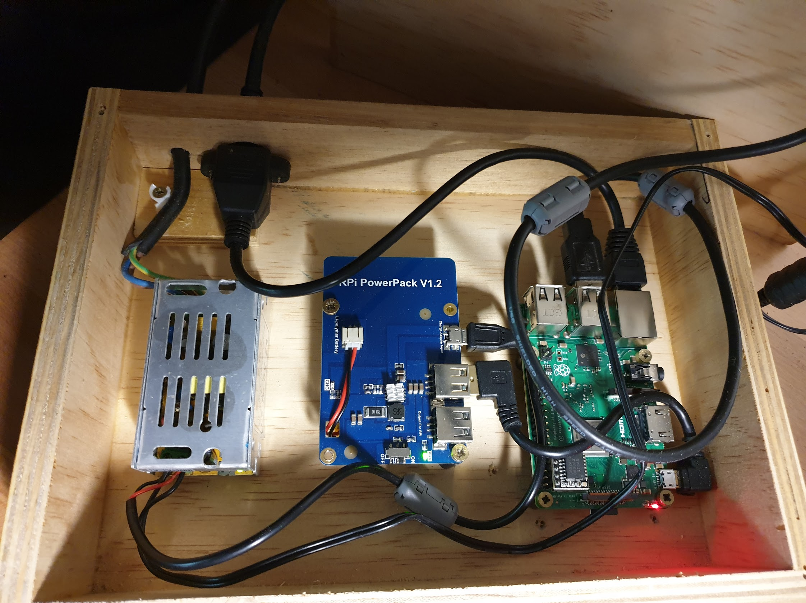

# weatherbox

Weather Station box for Davis vantage Pro weatherstation. The box houses a
Raspeberry Pi 3 with a battery backup and power supply. The Pi hosts weewx
which is available on the LAN at http://weather.local. The generated weather
reports are [synced to AWS](http://sthysel-weewx.s3-website-ap-southeast-1.amazonaws.com/index.html)

The Davis internal console sits on top of the box as it has a USB serial
connection to the Pi. The USB cable is fed through a hole in the lid top and
plugged into the rear of the console.

* Power supply
* Battery backup
* Pi

The box provides power to both the Pi and the console. Power is fed to the
console via the lid hole. Power is also fed to the powerpack, which in turns
feeds it to the Pi. In case of power loss the Pi keeps on recording console and
sensor data. The Davis Vantage Pro does keep about a week's data in its current
configuration so its redundant, which is nice.
